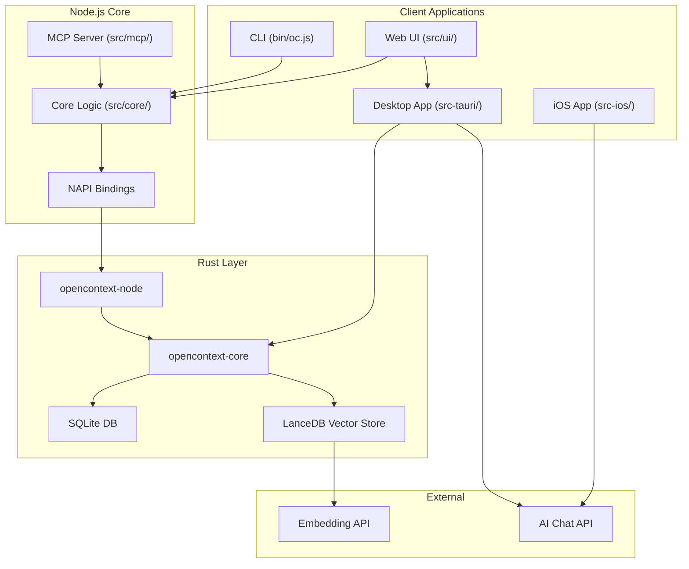

# OpenContext Codebase Map

> **Last mapped**: 2026-01-17
> **Total files**: 195 | **Total tokens**: ~305k

## System Overview



## Directory Structure

```
OpenContext/
├── bin/
│   └── oc.js                    # CLI entry point (commander.js)
├── crates/
│   ├── opencontext-core/        # Rust core library
│   │   └── src/
│   │       ├── lib.rs           # OpenContext struct, folder/doc ops
│   │       ├── events.rs        # Event bus for doc lifecycle
│   │       └── search/          # Vector search module
│   │           ├── chunker.rs   # Markdown → semantic chunks
│   │           ├── embedding.rs # OpenAI embedding API
│   │           ├── indexer.rs   # Build vector index
│   │           ├── searcher.rs  # Hybrid search (vector+BM25)
│   │           └── vector_store.rs # LanceDB operations
│   └── opencontext-node/        # NAPI bindings for Node.js
│       ├── src/lib.rs           # Rust → JS exports
│       └── index.js             # Platform binary loader
├── src/
│   ├── core/                    # Node.js core logic
│   │   ├── config.js            # Configuration management
│   │   ├── native.js            # Native bindings loader
│   │   ├── store-native.js      # Store adapter (folder/doc ops)
│   │   ├── agents.js            # Agent artifact generator
│   │   └── search/              # Search adapters
│   └── mcp/
│       └── server.js            # MCP server (AI tool exposure)
├── src/ui/                      # Web UI (Vite + React)
│   ├── src/
│   │   ├── App.jsx              # Main app + routing
│   │   ├── api.js               # Dual backend (Tauri/HTTP)
│   │   ├── components/          # React components
│   │   │   ├── IdeaTimeline.jsx # Timeline thread view
│   │   │   ├── TiptapMarkdown.jsx # Tiptap editor
│   │   │   ├── SearchModal.jsx  # Semantic search UI
│   │   │   └── SidebarTree.jsx  # Navigation tree
│   │   ├── hooks/               # Custom React hooks
│   │   └── editor/              # Editor extensions
│   └── server.js                # Express API server
├── src-tauri/                   # Tauri desktop app
│   └── src/main.rs              # 25 Tauri commands
├── src-ios/                     # iOS app (React Native)
│   ├── screens/                 # IdeasScreen, SettingsScreen
│   ├── services/                # ideas.js, ai.js
│   └── db/                      # SQLite schema
├── tests/                       # Test suites
└── .github/workflows/           # CI/CD pipelines
```

## Module Guide

### Rust Core (`crates/opencontext-core/`)

**Purpose**: Core storage and search functionality in Rust.

| File | Purpose | Key Exports |
|------|---------|-------------|
| `lib.rs` | Document/folder management | `OpenContext`, `Folder`, `Doc` |
| `events.rs` | Event bus for index sync | `EventBus`, `DocEvent`, `FolderEvent` |
| `search/chunker.rs` | Markdown semantic chunking | `Chunker::chunk()` |
| `search/embedding.rs` | OpenAI embedding API | `EmbeddingClient` |
| `search/indexer.rs` | Vector index builder | `Indexer::build_all()` |
| `search/searcher.rs` | Hybrid search (RRF fusion) | `Searcher::search()` |
| `search/vector_store.rs` | LanceDB operations | `VectorStore` |

**Key Data Structures**:
```rust
OpenContext { contexts_root, db_path, conn, event_bus }
Doc { id, folder_id, name, rel_path, stable_id, ... }
Chunk { file_path, content, heading_path, vector }
SearchOptions { query, limit, mode, aggregateBy }
```

### Node.js Core (`src/core/`)

**Purpose**: Node adapter layer over Rust bindings.

| File | Purpose |
|------|---------|
| `native.js` | Lazy NAPI loader with fallback |
| `store-native.js` | Store ops adapter (folders/docs) |
| `config.js` | Config management (JSON + env vars) |
| `agents.js` | Cursor/Claude artifact generator |
| `search/native-adapter.js` | Searcher/Indexer wrappers |

### MCP Server (`src/mcp/server.js`)

**Exposed Tools** (for AI assistants):

| Tool | Priority | Purpose |
|------|----------|---------|
| `oc_list_folders` | P0 | List folders |
| `oc_list_docs` | P0 | List docs in folder |
| `oc_manifest` | P0 | Generate context manifest |
| `oc_search` | P0 | Semantic search |
| `oc_create_doc` | P0 | Create document |
| `oc_resolve` | P1 | Resolve `oc://doc/<id>` |
| `oc_get_link` | P1 | Generate stable link |

### Web UI (`src/ui/`)

**Architecture**: Vite + React 19 + TailwindCSS

| Component | File | Purpose |
|-----------|------|---------|
| App | `App.jsx` | Main layout, routing, auto-save |
| Editor | `TiptapMarkdown.jsx` | Primary markdown editor |
| Timeline | `IdeaTimeline.jsx` | Threaded idea view |
| Search | `SearchModal.jsx` | Cmd+K semantic search |
| Sidebar | `SidebarTree.jsx` | Folder/doc navigation |

**Key Hooks**:
- `useDocLoader`: Document loading + conflict detection
- `useIdeaLoader`: Idea thread management
- `useFolderCache`: Folder tree caching

### Tauri Desktop (`src-tauri/`)

**Purpose**: Native desktop app wrapping Web UI.

**Commands** (25 total):
- Folder ops: `list_folders`, `create_folder`, `rename_folder`, `move_folder`, `remove_folder`
- Doc ops: `list_docs`, `create_doc`, `get_doc_content`, `save_doc_content`, etc.
- Search: `semantic_search`, `build_search_index`, `get_index_status`
- AI: `ai_chat` (streaming OpenAI/Ollama)

**Special Features**:
- `IndexSyncService`: Background index updates via event bus
- macOS Edit menu for WebView clipboard support

### iOS App (`src-ios/`)

**Purpose**: Mobile journaling app (separate from main system).

**Architecture**: React Native + Expo + SQLite

| Screen | Purpose |
|--------|---------|
| `IdeasScreen` | Timeline thread view with composer |
| `SettingsScreen` | AI config, language settings |
| `DocsScreen` | Placeholder (coming soon) |

**Key Differences from Web**:
- File-based thread storage (not SQLite)
- Local-only (no MCP/sync)
- AI reflection per thread

## Data Flow

### Document Creation
```
User → CLI/UI → store.createDoc()
                    ↓
              store-native.js
                    ↓
              native.createDoc() [NAPI]
                    ↓
              OpenContext::create_doc() [Rust]
                    ↓
              ├── Create file on disk
              ├── Insert row in SQLite
              └── Emit DocCreated event
                    ↓
              IndexSyncService batches updates
```

### Semantic Search
```
Query → Searcher.search()
            ↓
    ┌───────┴───────┐
    ↓               ↓
Vector Search   Keyword Search
(LanceDB)       (BM25)
    ↓               ↓
    └───────┬───────┘
            ↓
    RRF Score Fusion
            ↓
    Aggregation (content/doc/folder)
            ↓
    SearchResults
```

### AI Chat (Tauri)
```
Messages → ai_chat command
              ↓
    ┌─────────┴─────────┐
    ↓                   ↓
OpenAI-compatible    Ollama
(stream: true)       (/api/chat)
    ↓                   ↓
    └─────────┬─────────┘
              ↓
    window.emit("ai-stream-{id}")
              ↓
    Frontend renders tokens
```

## Conventions

### Code Style
- **JS/JSON**: 2-space indent
- **Rust**: `cargo fmt` enforced by pre-commit hook
- **React**: PascalCase components
- **Commits**: Conventional Commits (`feat:`, `fix:`, `chore:`)

### Path Handling
- All paths normalized to Unix-style (`/`)
- Database stores `rel_path`, resolves to `abs_path` at runtime
- Empty `rel_path` represents root contexts directory

### Stable References
- Every doc has a `stable_id` (UUIDv4)
- Links: `oc://doc/<stable_id>?path=<fallback>`
- Survives renames/moves

### Configuration Priority
```
Environment vars > config.json > defaults
```

### Event System
- Uses Tokio `broadcast` channel (capacity: 256)
- IndexSyncService batches updates every 5 minutes
- Events: `DocCreated`, `DocUpdated`, `DocDeleted`, `DocRenamed`, `DocMoved`

## Gotchas

### Rust Core
1. **Dimension mismatch**: Vector store reinitializes if embedding dimensions change
2. **Transaction scope**: Folder rename updates ALL descendant paths atomically
3. **File path escaping**: LanceDB delete requires SQL escaping of single quotes
4. **Ideas parsing**: Entry markers must be exact format or entries are skipped

### Node.js
1. **NAPI null error**: `generateManifest` defaults `limit=10` to prevent null conversion
2. **Index sync can't stop**: Native service spawns Tokio task with no stop mechanism
3. **Progress callbacks**: Not supported from Rust to Node (requires ThreadsafeFunction)

### Web UI
1. **Editor hydration**: `isHydratingContentRef` prevents save during load
2. **List type switching**: Tiptap converts list types on Space, not Enter
3. **Drag disabled during ops**: `dndDisabledRef` prevents issues during bulk operations
4. **Search aggregation**: Ideas use `content`, docs use `doc` level

### Tauri
1. **API key masking**: Shows first 3 + last 4 chars only
2. **Max tokens hardcoded**: OpenAI requests limited to 500 tokens
3. **Ollama URL detection**: Auto-detects local Ollama from port 11434

### iOS
1. **No cloud sync**: Everything local only
2. **Thread ID format**: Prefixed with `.ideas/` path
3. **Image paths**: Stored as absolute paths (not portable)

## Navigation Guide

### "Where is X handled?"

| Feature | Location |
|---------|----------|
| CLI commands | `bin/oc.js` |
| MCP tools | `src/mcp/server.js` |
| Document storage | `crates/opencontext-core/src/lib.rs` |
| Vector search | `crates/opencontext-core/src/search/` |
| NAPI bindings | `crates/opencontext-node/src/lib.rs` |
| Web UI routing | `src/ui/src/App.jsx` |
| Tauri commands | `src-tauri/src/main.rs` |
| iOS ideas | `src-ios/services/ideas.js` |
| CI pipelines | `.github/workflows/` |
| Cursor commands | `.cursor/commands/` |

### "How do I add a new..."

| Task | Steps |
|------|-------|
| **CLI command** | Add in `bin/oc.js` using commander.js |
| **MCP tool** | Add in `src/mcp/server.js`, follow existing pattern |
| **Tauri command** | Add `#[tauri::command]` in `src-tauri/src/main.rs`, register in `invoke_handler!` |
| **React component** | Create in `src/ui/src/components/`, import in `App.jsx` |
| **Rust feature** | Add to `crates/opencontext-core/src/lib.rs`, expose via NAPI in `opencontext-node` |

## Build & Test Commands

```bash
# Development
npm install           # Install + setup hooks
npm run ui:dev        # Vite dev server
npm run tauri:dev     # Desktop app dev
npm run mcp           # MCP server

# Testing
npm test              # Core + search + native
npm run test:all      # All tests including Rust
npm run test:rust     # Rust tests only

# Production
npm run ui:build      # Build Web UI
npm run tauri:build   # Build desktop app
```

## Architecture Decisions

1. **Rust core with Node adapter**: Performance-critical ops in Rust, JS for flexibility
2. **LanceDB for vectors**: Embedded vector DB, no server required
3. **Event-driven index sync**: Decoupled, batched updates prevent API rate limits
4. **Dual backend (Tauri/HTTP)**: Same React app works in desktop and browser
5. **Stable IDs for docs**: References survive renames/moves
6. **Separate iOS app**: Mobile-first UX differs significantly from desktop

---

*Generated by Cartographer. If this helped, consider starring: https://github.com/kingbootoshi/cartographer*
